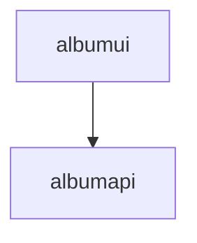

# デプロイ用のマニフェストファイル

|アプリ|リポジトリ|
|--|--|
|UIアプリ|https://github.com/akubicharm/containerapps-albumui|
|APIアプリ|https://github.com/akubicharm/https://github.com/akubicharm/containerapps-albumapi-javascript|
|マニフェストファイル|https://github.com/akubicharm/containerapps-albumui-manifest|

## 実行時の設定

albumui アプリはデフォルトで3000ポート、alubumapi アプリはデフォルトで3500ポートでリッスンする。

albumui からバックエンドの呼び出しは、`${API_BASE_URL}/albums` となるので、albumapi のURLを環境変数または`.env` ファイルで`API_BASE_URL` を設定してから起動する。

oc new-app openshift/nodejs:20-minimal-ubi8~https://github.com/akubicharm/containerapps-albumapi-javascript  \
--context-dir=src \
--dry-run -o yaml > app.yaml

oc new-app openshift/nodejs:20-minimal-ubi8~https://github.com/akubicharm/containerapps-albumui  \
--context-dir=src \
--dry-run -o yaml > app.yaml
